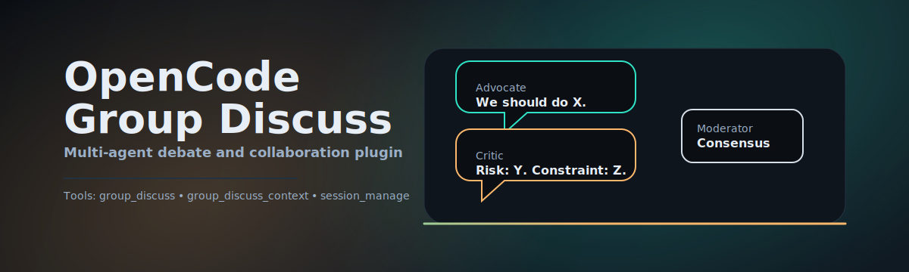

# OpenCode Group Discuss

<p align="center">
  
</p>

<p align="center">
  <a href="./README.md">English Docs</a> | <b>中文文档</b>
</p>

> [!WARNING]
> **安全警告：文件沙箱十分严格。**
> - `files` 只能读取 OpenCode 项目根目录下的文件（包含 `realpath` 防逃逸检测）。
> - 限制：最多 10 个文件；单文件最大 256 KiB；总计最大 1 MiB（超出会直接失败）。

[](https://github.com/Erinable/opencode-group-discuss/actions/workflows/ci.yml)
[](./LICENSE)

---

# 别让你的 Agent 单打独斗。给它一支团队。

[Claude Code](https://www.claude.com/product/claude-code) 很强，DeepSeek 很聪明。
但如果你在构建复杂的企业级软件，**由于你自己都有团队，为什么要让 AI 单干？**

**OpenCode Group Discuss** 将“专家评审团”带入你的终端。
**停止像保姆一样盯着你的 Agent。让它们自己去辩论、去博弈，直到通过方案。**

- **辩论模式 (Debate Mode)**：拿不准主意？让 *Advocate（正方）* 和 *Critic（反方）* 互博，最后由 *Moderator（裁判）* 给出客观结论。
- **协作模式 (Collaborative Mode)**：要做大系统？召唤 *架构师*、*DBA* 和 *安全专家* 坐下来一起开会，现场出方案。
- **共识引擎 (Consensus Engine)**：这不只是聊天。它能检测共识度，打破僵局，并强制输出最终决策。
- **杜绝幻觉死循环**：可配置的轮次限制和严格的上下文预算，防止模型“一本正经地胡说八道”。

还记得你上次没经 Code Review 就合并代码是什么后果吗？是的，AI 写代码也一样。
**这不仅仅是一个插件。这是你的 AI 工程经理。**

## 甚至不需要读这个 Readme

### 现在是 Agent 的时代

**直接把这个链接扔给 Claude Code / OpenCode，让它自己学。**
问问它为什么多 Agent 协作比单发 Prompt 更好，问问它怎么避免“讨好型人格”。

```text
Hey，请读一下这个 README，并解释一下在做架构决策时，为什么 "Group Discuss" 比单个 Agent 更靠谱？
https://raw.githubusercontent.com/Erinable/opencode-group-discuss/master/README.md
```

### 🪄 魔法咒语：`preset`

**不想手写一堆 JSON 配置？直接用 `preset`。**

我们将最佳实践直接内置了。

- `tech-review`: 3 轮辩论，专门用于技术选型（Vue vs React?）。
- `code-review`: 作者 vs 审查者 vs 安全专家。
- `architecture`: 高维度的系统设计委员会。

只需要输入：
```javascript
group_discuss({ "preset": "tech-review", "topic": "Next.js 还是 Remix？请基于我们的现状分析。" })
```
然后看着它们吵架（并得出结论）。

## 安装 (Installation)

### 人类用户

1. 在你的 OpenCode 项目中安装：
   ```bash
   npm install -D opencode-group-discuss
   ```

2. 在 `opencode.json` 中启用：
   ```json
   {
     "plugin": ["opencode-group-discuss"]
   }
   ```

### LLM Agent 用户

获取安装指南并让 Agent 执行（是的，你可以直接命令你的 Agent 做这事）：

```bash
npm install -D opencode-group-discuss && \
node -e 'const fs=require("fs"); const p="opencode.json"; const c=JSON.parse(fs.readFileSync(p)); if(!c.plugin.includes("opencode-group-discuss")) { c.plugin.push("opencode-group-discuss"); fs.writeFileSync(p, JSON.stringify(c, null, 2)); }'
```

## 核心特性 (Features that Matter)

### 1. 辩论模式 (The "Truth Seeker")
单个 Agent 往往有偏见，而且喜欢讨好用户（Sycophancy）。
**辩论模式强制引入冲突。**
- **Advocate**: 提出方案，并极力辩护。
- **Critic**: 无情地寻找边缘情况、安全漏洞和扩展性瓶颈。
- **Moderator**: 冷眼旁观，最后基于*逻辑*而非*礼貌*给出裁决。

### 2. 协作模式 (The "Builder")
针对多面手的复杂问题。
- 需要设计表结构？**DBA** Agent 负责。
- 需要 API 定义？**Backend** Agent 负责。
- 需要合规？**Security** Agent 实时审计。

### 3. 上下文预算 (Context Budgeting)
Token 很贵，上下文窗口很宝贵。
本插件实现了 **智能上下文预算**：
- 讨论记录过长时自动压缩。
- 在丢弃原始文本前提取关键洞察 (Insights)。
- 确保你的 Token 账单不会爆炸，同时保留会议的“长期记忆”。

## 快速开始 (Quick Start)

**1. 检查状态：**
```javascript
group_discuss_context()
```

**2. 发起一个简单的辩论：**
```javascript
group_discuss({
  "topic": "在高并发日志系统中，选 PostgreSQL 还是 MySQL？",
  "preset": "tech-review"
})
```

**3. 开一场定制的董事会会议：**
```javascript
group_discuss({
  "topic": "设计一个高可用支付网关",
  "mode": "collaborative",
  "participants": [
    { "name": "Architect", "subagent_type": "critic", "role": "可靠性与SLA" },
    { "name": "Security", "subagent_type": "critic", "role": "PCI 合规性" },
    { "name": "Product", "subagent_type": "general", "role": "用户体验与转化率" }
  ],
  "rounds": 4
})
```

## 配置 (Configuration)

非常有主见，但也可以调整。
详见 `docs/CONFIG.md`。

**配置文件位置：**
- 项目级：`.opencode/group-discuss.json`
- 全局级：`~/.config/opencode/group-discuss.json`

**关键参数：**
- `consensus.threshold`: 需要多少达成一致才能提前结束？(0.0 - 1.0)
- `termination.enable_stalemate_detection`: 如果它们在车轱辘话来回说，直接终止会议。
- `context_budget.profile`: `small` (省钱), `balanced` (标准), 或 `large` (深度思考)。

---

## 故障排除 (Troubleshooting)

**"Unauthorized" / 401?**
OpenCode Desktop 的认证 Token 问题。重启 OpenCode 客户端通常能解决。

**找不到工具 (Tool not found)?**
确认加到 `opencode.json` 了吗？重启了吗？

---

## 贡献 (Contributing)

欢迎提交 PR。
如果你觉得你能写出更好的 Moderator 提示词，欢迎来战。

## 许可证 (License)

MIT
